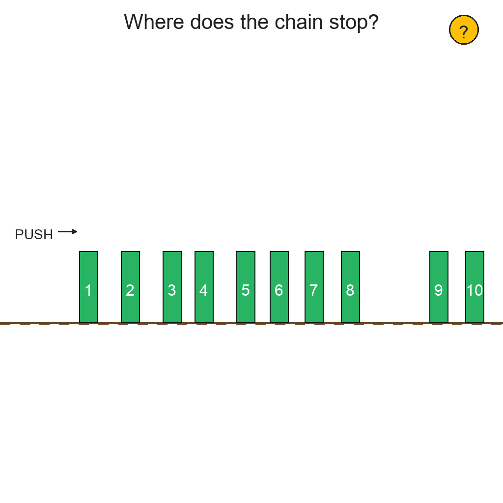
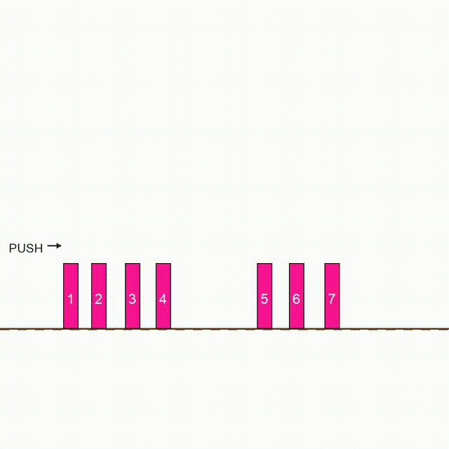
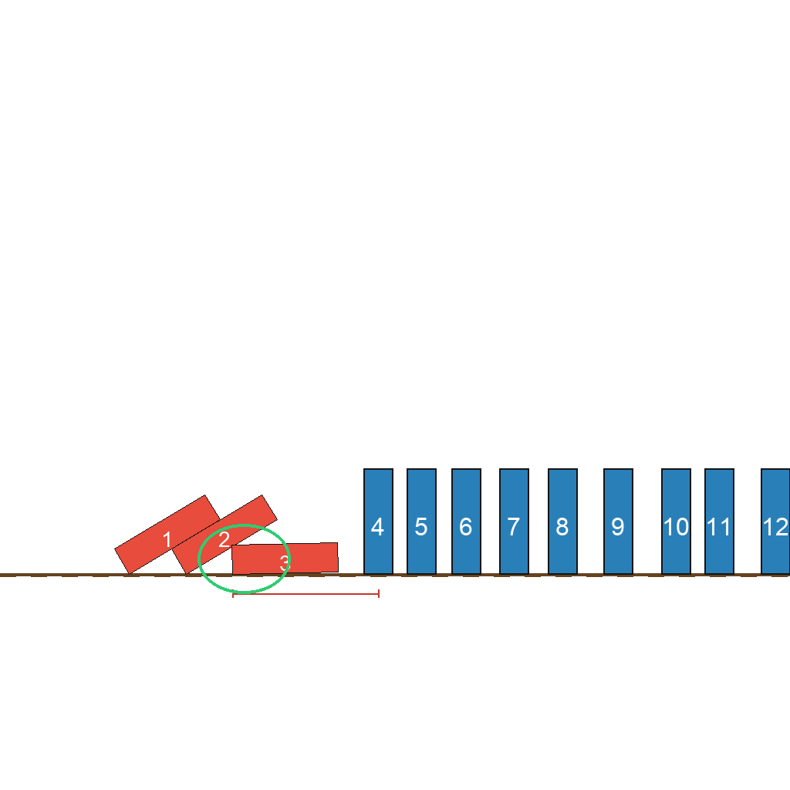

# O-24: Domino Chain Gap Analysis Data Generator

Generates synthetic physics simulation tasks involving domino chains with gaps. The task is to identify which domino will be the last to fall when the chain reaction encounters a gap that is too wide to cross.

Each sample pairs a **task** (first frame + prompt describing what needs to happen) with its **ground truth solution** (final frame showing the result + video demonstrating how to achieve it). This structure enables both model evaluation and training.

---

## 📌 Basic Information

| Property | Value |
|----------|-------|
| **Task ID** | O-24 |
| **Task** | Domino Chain Gap Analysis |
| **Category** | Physics Simulation/Gap Detection |
| **Resolution** | 1024×1024 px |
| **FPS** | 16 fps |
| **Duration** | varies |
| **Output** | PNG images + MP4 video |

---

## 🚀 Usage

### Installation

```bash
# Clone the repository
git clone https://github.com/VBVR-DataFactory/O-24_domino_chain_gap_analysis_data-generator.git
cd O-24_domino_chain_gap_analysis_data-generator

# Install dependencies
pip install -r requirements.txt
```

### Generate Data

```bash
# Generate 100 samples
python examples/generate.py --num-samples 100

# Generate with specific seed
python examples/generate.py --num-samples 100 --seed 42

# Generate without videos
python examples/generate.py --num-samples 100 --no-videos

# Custom output directory
python examples/generate.py --num-samples 100 --output data/my_output
```

### Command-Line Options

| Argument | Type | Description | Default |
|----------|------|-------------|---------|
| `--num-samples` | int | Number of samples to generate | 100 |
| `--seed` | int | Random seed for reproducibility | Random |
| `--output` | str | Output directory | data |
| `--no-videos` | flag | Skip video generation | False |

---

## 📖 Task Example

### Prompt

```
Analyze the domino chain to find which domino is the last to fall. Push the first domino and watch as each domino falls and turns red. The chain will stop when it reaches a gap that is too wide. This gap will be marked "TOO FAR!" in red. The last fallen domino will be circled in green as the answer.
```

### Visual

<table>
<tr>
  <td align="center"></td>
  <td align="center"></td>
  <td align="center"></td>
</tr>
<tr>
  <td align="center"><b>Initial Frame</b><br/>Domino chain with varying spacing</td>
  <td align="center"><b>Animation</b><br/>Dominos falling until gap is reached</td>
  <td align="center"><b>Final Frame</b><br/>Last fallen domino circled, gap marked</td>
</tr>
</table>

---

## 📖 Task Description

### Objective

Identify which domino will be the last to fall in a chain when the chain reaction is stopped by a gap that is too wide for the falling domino to reach the next one.

### Task Setup

- **Domino Chain**: Linear arrangement of 7-12 dominos in side view
- **Variable Spacing**: Normal spacing (60-90 px) between most dominos
- **Gap**: One gap with excessive spacing (180-240 px) that stops the chain
- **Physics Threshold**: Domino can reach up to 90% of its height (126 px for 140 px tall domino)
- **Visual Indicators**: Gap marked "TOO FAR!" in red, last fallen domino circled in green

### Key Features

- **Gap detection**: Tests understanding of physical reach limitations in domino chains
- **Physics reasoning**: Requires calculating whether a falling domino can reach the next one
- **Sequential simulation**: Dominos fall one by one until the gap is encountered
- **Visual state change**: Fallen dominos turn from blue to red
- **Clear answer marking**: Last fallen domino is highlighted with green circle
- **Explicit gap labeling**: "TOO FAR!" text marks the problematic gap
- **Variable chain length**: 7-12 dominos create different difficulty levels

---

## 📦 Data Format

```
data/domino_chain_gap_analysis_task/
├── domino_chain_gap_analysis_0000/
│   ├── first_frame.png          # Initial state (all dominos standing)
│   ├── final_frame.png          # Final state (last fallen domino marked)
│   ├── prompt.txt               # Task instructions
│   └── ground_truth.mp4         # Solution video (16 fps)
├── domino_chain_gap_analysis_0001/
│   └── ...
```

**File specifications**: Images are 1024×1024 PNG. Videos are MP4 at 16 fps, duration varies based on chain length.

---

## 🏷️ Tags

`physics-simulation` `domino-effect` `gap-detection` `spatial-reasoning` `reach-analysis` `chain-reaction` `failure-point`

---
